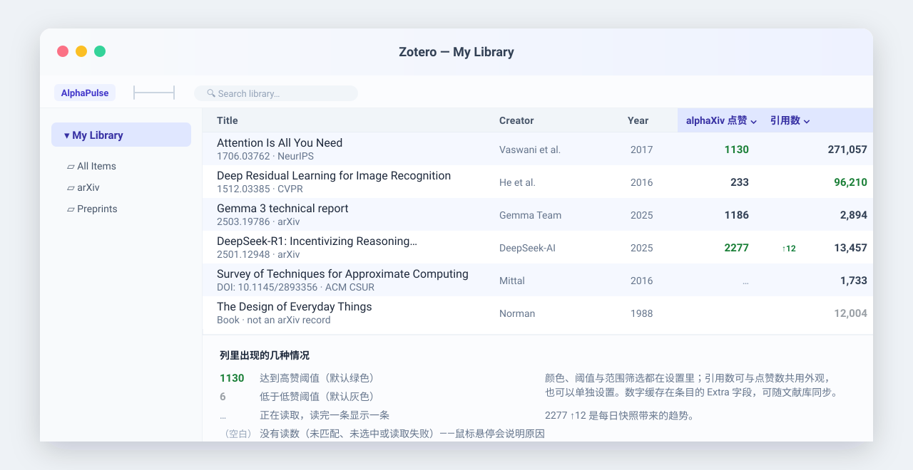
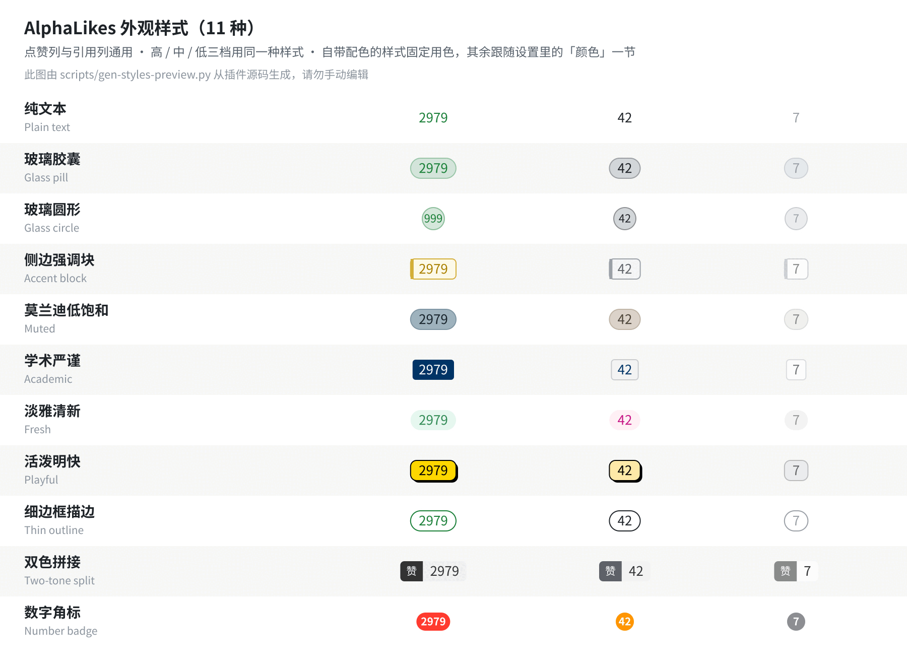

# AlphaPulse

**给 Zotero 加两列：alphaXiv 点赞数，和引用数（默认走 Google Scholar）。**

[](https://www.zotero.org/)
[](https://github.com/IrisM6/AlphaPulse/releases/latest)
[](LICENSE)

装了就能用：不用 API key，不用注册，也不用手动绑定论文。列表里滚到哪读到哪，数字写回条目的 `Extra` 字段，重装或换电脑都不会丢。



## 安装

1. 在 [最新版本](https://github.com/IrisM6/AlphaPulse/releases/latest) 里下载 `.xpi` 文件（文件名带版本号）。
2. Zotero → **工具 → 插件** → 齿轮 → **从文件安装插件…**。
3. 选下载好的 `.xpi`，按提示重启 Zotero。

支持 Zotero 7 / 8 / 9 / 10 / 11。也可以在 **Zotero Addons** 插件商店里搜索 **AlphaPulse** 一键安装。

## 两列

在条目列表的列头上右键，勾选 **alphaXiv 点赞** 和 **引用数**；点列头按数值排序。两列各读各的，互不影响。

**alphaXiv 点赞数**——比引用数反应快，新论文有没有人在读，一眼就能看出来。

- 从条目的 `URL`、`DOI` 或 `Extra` 自动识别 arXiv ID；没有 ID 的按 DOI 与标题查询学术 API，**只采用高置信度的结果**。
- 滚到哪读到哪，**读完一条显示一条**；记录每日快照，列里可以显示 `1130 ↑12` 这样的变化。

**引用数**——默认 **Google Scholar**，可换成 OpenAlex 或 Semantic Scholar；勾一个只显示那一个，勾多个显示其中最大的数字，悬停可看来源。

- 引用数变化慢，缓存时间比点赞数长，可以单独设置外观与阈值。
- Google Scholar 没有公开 API，读的是搜索结果页上的 `Cited by`；被限流或要求人机验证时自动暂停重试（10 分钟起，最长 2 小时），**不会用别的来源顶替**，其它来源照常自动填充。
- 数字读不到可以手动填：右键 → **手动填写引用量…**。在浏览器里打开检索页只是自己核对用，不会解除插件这边的限制。

### 读取节奏

Google Scholar 不喜欢机器一样的节奏，所以两次搜索之间**随机等 16–30 秒**，打开页面后先向下滚一点、**停留 4–8 秒**再读，每读完 **8–15 条**就歇 **15–40 分钟**。四个范围都能在 设置 → AlphaPulse 里改，每个框旁边写着建议值；下面一行**「当前：…」**把数字连成一句话，改一个字段就跟着变。菜单顶部写着**本次会话已请求多少次、距离下次请求还有多久**，列里没动静时看一眼就知道是在等还是停了。

## 一个入口，功能都在里面

菜单栏 **工具 → AlphaPulse**，或者右键任意条目 → **AlphaPulse**：一个图标加插件名，悬停展开全部功能。

| 菜单项                               | 作用                                                           |
| ------------------------------------ | -------------------------------------------------------------- |
| 刷新点赞数                           | 重新读取所选条目的点赞数                                       |
| 刷新引用数                           | 重新读取所选条目的引用数                                       |
| 打开 alphaXiv 页面                   | 在浏览器里打开这篇论文的 alphaXiv 页面，也就是点赞数真正的出处 |
| 在浏览器中打开 Google Scholar 搜索页 | 用论文标题在浏览器里打开检索页，方便核对                       |
| 手动填写引用量…                      | 自己填一个引用数，显示在引用列里，自动读取不再覆盖它           |
| 清除本插件写入的 Extra 记录          | 只删本插件写的行，条目里其它内容不动                           |

刷新只作用在选中的条目上，读取期间单元格显示 `…`，完成后弹一条结果提示。条目还没识别出 arXiv ID 时，「打开 alphaXiv 页面」会隐藏；选中多条时「手动填写引用量…」会隐藏（一个数字只属于一条）。

## 外观

11 种样式，**点赞列和引用列共用同一套**；下面这张图是从插件源码生成的，就是列里实际的样子：



两列都可按**固定阈值**或**当前列表的分位数**分档着色，颜色框是取色面板（色域 + 色相条），也能按点赞 / 引用数区间筛选，范围外的条目整格变淡；引用数可以跟随点赞的外观，也可以单独设置。完整对照表见 [docs/styles-preview.html](docs/styles-preview.html)。

## 数据与隐私

- 点赞数、引用数、arXiv ID、每日快照都写在条目的 `Extra` 字段里（`alphaxiv_*` 行），可随文献库同步。
- 联网请求只发往 alphaXiv、arXiv、OpenAlex、Semantic Scholar、Crossref、Google Scholar 这些学术站点，不发送文献库内容或个人信息。
- 只有「清除本插件写入的 Extra 记录」会删数据，且只删本插件自己写的那几行。

## 读不出来时

- **某一列一直是空白或 `…`**：鼠标停在那一个格子上，提示会写清原因（被拒绝、被限流、超时……）和**多久之后自动重试**，不需要做任何事。
- **要等好几分钟**：多半是碰上上面说的「休息」，提示里写着还剩多少分钟。
- **Google Scholar 被拦住**：插件会自己清掉这边的 Google Cookie 再重试，不需要处理；同时勾上 OpenAlex / Semantic Scholar 可以先照常使用。
- **想手动填一个引用数**：右键 → **手动填写引用量…**；填进去就一直显示，清空输入框就交回自动读取。
- **想重新开始**：右键 → **清除本插件写入的 Extra 记录**，条目回到未读取状态，下次刷新重新写入。

## 开发

```bash
npm install
npm run lint:check   # 代码风格与静态检查
npm run test         # 在真实 Zotero 中运行测试
npm run build        # 产物在 .scaffold/build/
npm run release      # 打 tag 并发布
```

## 许可

AGPL-3.0。基于 [zotero-plugin-template](https://github.com/windingwind/zotero-plugin-template) 构建；点赞数据来自 [alphaXiv](https://www.alphaxiv.org/)，引用数据来自 Google Scholar / OpenAlex / Semantic Scholar。
