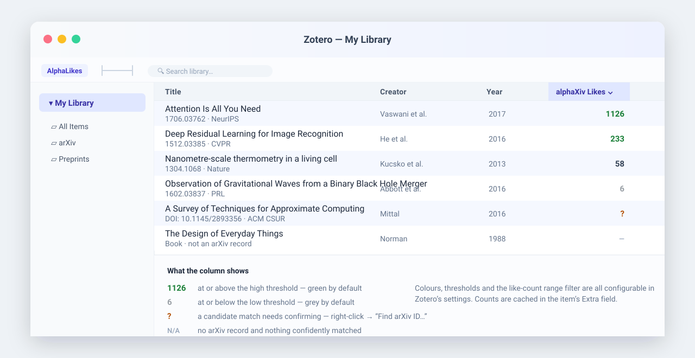

# AlphaLikes

**Zotero 的 alphaXiv 点赞列**

[](https://www.zotero.org/)
[](https://github.com/IrisM6/AlphaLikes/releases/latest)
[](https://github.com/IrisM6/AlphaLikes/actions/workflows/ci.yml)
[](https://github.com/windingwind/zotero-plugin-template)
[](LICENSE)

AlphaLikes 是一个可排序的 Zotero 条目列表列。它从条目的 `URL`、`DOI` 或 `Extra` 字段识别 arXiv ID，从 [alphaXiv](https://www.alphaxiv.org/) 页面读取点赞数，并把成功结果持久化到 Zotero 条目中。

从 v1.1.0 起，**没有 arXiv ID 的条目也能自动匹配**：插件会通过 DOI 和标题查询多个免费学术 API，对候选结果打分，高置信度的自动采用。

从 v1.3.0 起，插件还会读取**引用数**、记录**点赞数的每日变化**（列里显示 `2979 ↑12`）、支持**按当前列表排名的分位数着色**与**批量匹配**。

从 v1.4.0 起，引用数增加 **Google Scholar** 来源。

从 v1.6.0 起，引用数**只显示你选中的那一个来源**（默认为覆盖最广的 **Google Scholar**），再也不会用别的来源顶替：被引数不是同一个口径，Google Scholar 收录预印本、学位论文与书籍，和 OpenAlex 的数字可能差一倍。Google Scholar 要求人机验证时会**暂停并提示**，约 10 分钟后**自动重试**（继续被拦则翻倍，最长 2 小时），也可以从右键菜单打开验证页自己完成验证。

从 v1.7.0 起：引用来源**可以多选**，勾选多个时全部查询并显示其中**最大**的数字（只勾一个时仍然严格只看那一个来源）；右键菜单新增 **刷新引用数**，与点赞数刷新分开；Google Scholar 的读取改为**全自动**，被拦住先静默重试，连续多次仍未成功才提示一次；「打开 Google Scholar 验证页」会带上当前论文标题直接搜索，引用列可以有自己的样式、配色、阈值与范围筛选，用「与点赞数外观关联」开关与点赞分开。

从 v1.8.0 起：匹配**完全自动**——「查找 arXiv…」「批量查找 arXiv…」「选择 Google Scholar 文献…」「清除 AlphaLikes 数据」全部移除，只有高置信度的匹配会被采用，中等相似度的结果视为“未找到”（不再有确认弹窗）；**引用数与点赞数用同一套着色逻辑**（按固定阈值或按当前列表的分位数分档，而不是整列一个颜色）；每个颜色框改成**取色面板**（明度/饱和度色域 + 色相条，一个圆圈拖动取色，旁边有颜色预览），并且**自带配色的样式现在真的会跟着颜色设置走**——改过颜色后样式仍保留自己的形状与质感，只换成你选的色相，点「恢复这个样式的默认颜色」即可回到原生配色；「分位」与「阈值」两组输入按当前**着色依据**只显示其中一组；「点赞数范围筛选」移到引用设置之前。

从 v1.5.0 起，外观样式精简为 **11 种**（去掉「纯文本极简」「典雅精致」与重复的玻璃胶囊变体），所有样式名称不再带括号说明；「数字角标」完整显示数字，不再缩写成 `99+`；范围筛选只保留「范围外变淡」这一种表现（开关随之删除）；**设置改动即时生效**：切换「在列里显示每日变化」等选项不再需要手动刷新。同时把兼容范围扩到 Zotero 7 – 10（见下）。

> AlphaLikes is a Zotero 7–10 plugin that adds a sortable **alphaXiv Likes** column for arXiv papers, with automatic arXiv-ID matching, colour coding and like-count filtering.

## 功能

- 在 Zotero 条目列表中注册 **alphaXiv Likes** 列，可点击列头按数值排序；
- 识别现代及旧式 arXiv ID，例如：
  - `https://arxiv.org/abs/2301.12345`
  - `https://arxiv.org/pdf/hep-th/9901001.pdf`
  - `Extra` 中的 `arXiv: 2301.12345`
  - `DOI: 10.48550/arXiv.2301.12345`（无需联网即可解析）
- **非 arXiv 条目自动匹配**：通过 DOI、标题、作者、年份查询 Semantic Scholar、OpenAlex、Crossref 和 arXiv API，用相似度打分后决定“自动采用 / 未找到”（只有高置信度采用）；
- **两个刷新动作，反馈明确**：右键 → **刷新 alphaXiv 点赞** 重新抓取点赞数（单元格显示读取状态，失败时保留上一次的数字），**刷新引用数** 单独重读引用数并立即解除 Google Scholar 的等待；也可设置缓存过期天数自动刷新；
- **引用数列**：注册第二个可排序列，来源可勾选 **Google Scholar（默认）/ OpenAlex / Semantic Scholar**——勾一个时只看那一个，不会互相顶替；勾多个时全部查询并显示其中**最大的数字**，悬停会显示数字来自哪个来源。选 OpenAlex 时，位于本领域前 10% 的成果带 ▲ 标记；
- **Google 读取不再全盘失败**：发往 Google 的请求改用与本机浏览器一致的 User-Agent，并先写入 Google 的同意 cookie（`SOCS=CAI`）；人机验证返回的 403 / 429 / 503 也按“验证”处理，不再当成一次读取失败（arXiv、OpenAlex 等 API 的请求标识保持不变）；
- **清除功能**：右键 → **清除本插件写入的 Extra 记录**，只删本插件写在 `Extra` 里的行，条目原有的其他内容一行不动；清除过的条目保持空白、不再自动写回，手动刷新点赞或引用即可恢复；
- **被人机验证拦住也不会卡死**：Google Scholar 要验证时**先静默等待**（头两次不打扰你），仍被拦才提示一次：说明原因、约多久后重试（10 分钟起，逐次翻倍，最长 2 小时）；那段时间该列显示「暂无」并说明原因，右键 →「打开 Google Scholar 验证页」会带上论文标题直接搜索，可在浏览器里自己完成验证，回来点一次 **刷新引用数** 即可；
- **点赞趋势**：每次刷新记录当天的点赞数（保留最近若干天），列里显示每日变化，例如 `2979 ↑12`，增长达到阈值时标为“近期热门”；
- **11 种外观样式**：纯文本、玻璃胶囊、玻璃圆形、侧边强调块、莫兰迪低饱和、学术严谨、淡雅清新、活泼明快、细边框描边、双色拼接、数字角标（名称不带括号说明，效果见下方预览页）；引用列默认跟随点赞列，也可以用「与点赞数外观关联」开关脱钩，单独设置样式、配色与筛选；
- **颜色标记**：高赞绿色、低赞灰色、中间色可留空跟随主题；阈值与颜色都可自定义，**11 种样式全部适用**——自带配色的那 7 种会把你选的色相套进自己的配方（侧边强调块仍是左侧竖块、莫兰迪仍是柔和低饱和底），点「**恢复这个样式的默认颜色**」即可回到原样；每个颜色框左边有当前颜色的**预览**，点一下打开**取色面板**：上面是明度/饱和度色域、下面是色相条，拖动唯一的圆圈取色，也可以直接手输 CSS 颜色；
- **分位数着色**：**点赞列与引用列都可用**，各自有「着色依据」开关；选「分位数」时只显示分位数输入（默认低于 40 分位为低、高于 80 分位为高），选「固定阈值」时只显示阈值输入，样本太少或所有数字相同时自动退回固定阈值；
- **点赞数范围筛选**：输入最小/最大点赞数，区间外的条目仍然显示、整格变淡（数字不受影响，排序仍按真实数值）；
- 异步、串行抓取，同一主机两次请求间隔至少 1.5 秒（arXiv API 为 3 秒）；
- 断网、非 2xx 响应或页面结构变化时显示 `N/A`，不会中断 Zotero；
- **改动即时生效**：设置面板里任何选项一改，已打开的条目列表立刻按新设置重绘（含趋势箭头、配色与范围筛选）；
- 设置界面集成在 Zotero 的 **编辑 → 设置 → AlphaLikes** 中。

## 非 arXiv 条目如何找到 arXiv 地址

插件用学术 API 反查 arXiv ID，优先级从高到低：

| 步骤 | 数据源                                                                      | 说明                                                            |
| ---- | --------------------------------------------------------------------------- | --------------------------------------------------------------- |
| 1    | DOI 前缀                                                                    | `10.48550/arXiv.*` 直接解析，零网络请求                         |
| 2    | [Semantic Scholar](https://api.semanticscholar.org/)                        | `paper/DOI:<doi>` 的 `externalIds.ArXiv` 最准确                 |
| 3    | [OpenAlex](https://api.openalex.org/)                                       | 从 work 的 `locations[]` 里找 `arxiv.org/abs` 或 `/pdf` 链接    |
| 4    | [Unpaywall](https://unpaywall.org/)                                         | 需在设置中填写联系邮箱，默认关闭                                |
| 5    | [Crossref](https://api.crossref.org/)                                       | 拿不到 arXiv ID，但能提供权威标题/作者/年份，用于下面的标题检索 |
| 6    | [arXiv API](https://info.arxiv.org/help/api/) + Semantic Scholar + OpenAlex | 用标题检索，`ti:"…"` 无结果时回退到 `all:"…"`                   |

**相似度评分**（`src/modules/similarity.ts`）：

- 标题相似度 = `0.6 × 归一化编辑距离 + 0.4 × 词元 Jaccard`；标题被完全包含且长度比 ≥ 0.8 时记为 0.96（用于期刊版带副标题的情况）；
- 作者匹配：任一位作者姓氏一致即通过，`Vaswani, Ashish` 与 `Ashish Vaswani` 视为同一人；
- 年份：相差 ≤ 1 年即通过。

**综合置信度**：

```
score = (0.7 × 标题相似度 + 0.2 × 作者匹配 + 0.1 × 年份匹配) / 实际可用的权重之和
```

权重会按“双方都提供了的信号”重新归一化——条目本身没有作者或年份时不会被扣分。由 DOI 直接确认的候选视为权威结果，直接记为 1.0。

| 置信度 | 默认区间  | 行为                                |
| ------ | --------- | ----------------------------------- |
| 高     | ≥ 0.9     | 自动采用，写入 `Extra` 并抓取点赞数 |
| 中     | 0.7 – 0.9 | 视为“未找到”，显示 `N/A`（不写入）  |
| 低     | < 0.7     | 不采用，显示 `N/A`                  |

只有高置信度的结果会被采用：匹配没有任何弹窗，也不存在“待确认”状态，所以宁可留空，也不会写入一个不确定的 ID。

结果会按 DOI 或归一化标题缓存 24 小时，未命中的缓存 10 分钟。

## 界面



_界面示意图；主题、列宽和实际点赞数会因 Zotero 环境及 alphaXiv 数据而不同。_

## 安装

### 从 GitHub Release 安装

1. 下载最新的 [`alphalikes.xpi`](https://github.com/IrisM6/AlphaLikes/releases/latest/download/alphalikes.xpi)。
2. 在 Zotero 中打开 **工具 → 插件**。
3. 点击齿轮菜单，选择 **Install Plugin From File… / 从文件安装插件…**。
4. 选择下载的 `.xpi`，按提示重启 Zotero。

插件 ID：`alphalikes@iris`。支持 Zotero 7、8、9 和 10（`strict_max_version` 为 `*`，后续大版本也能直接安装）。

## 使用

### 显示列

1. 在 Zotero 条目列表的列头上右键。
2. 勾选 **alphaXiv Likes**（若该列尚未显示）。
3. 滚动到 arXiv 条目时，单元格先显示 `…`，随后显示点赞数。
4. 点击列头可以升序或降序排列。

### 右键菜单

| 菜单项                          | 作用                                                                                          |
| ------------------------------- | --------------------------------------------------------------------------------------------- |
| **刷新 alphaXiv 点赞**          | 忽略缓存与失败冷却，重新抓取所选条目的**点赞数**；没有 ID 的条目会重新尝试匹配                |
| **刷新引用数**                  | 只重新读取所选条目的**引用数**，并解除 Google Scholar 的等待后立即重试                        |
| **打开 Google Scholar 验证页**  | 在浏览器里用当前论文标题打开检索页，自己完成人机验证                                          |
| **清除本插件写入的 Extra 记录** | 删除所选条目中本插件写入 `Extra` 的行，**不影响其他内容**；这些条目在手动刷新前不会被再次写入 |

菜单只有这四项：匹配与引用数的读取都是自动进行的，唯一需要你动手的情形是 Google 的人机验证。四项都在选中条目时出现，多选时对每条依次执行。清除是唯一会删除数据的动作，范围严格限定在本插件自己写的行。

### 外观样式

设置里的**外观 → 显示样式**共有 11 种，点赞列与引用列都会套用。其中 4 种只改变形状与质感，颜色来自「颜色」一节（高/中/低三档）；另外 7 种自带一套配色，会用各自的深浅版本表达高赞/低赞，关闭着色后则统一显示它们的中间档：

| #   | 样式         | 外观                                     | 自带配色                                      |
| --- | ------------ | ---------------------------------------- | --------------------------------------------- |
| 1   | 纯文本       | 只有数字                                 | 用「颜色」一节的配色                          |
| 2   | 玻璃胶囊     | 圆角胶囊 + 半透明浅底与描边              | 由「高赞颜色」着色                            |
| 3   | 玻璃圆形     | 圆底角标（数字变长时自动变胶囊，不缩写） | 由「高赞颜色」着色                            |
| 4   | 侧边强调块   | 左侧金色竖块 + 米黄底                    | 高：`#D4AF37` / `#FDF9E8` / `#A67C00`         |
| 5   | 莫兰迪低饱和 | 大圆角、哑光，三档明度差距拉大           | 高：`#9FB3BF` / 中：`#DCD3C9` / 低：`#F1F1EF` |
| 6   | 学术严谨     | 直角小圆角、实底或细灰边、等宽数字       | 高：`#003366` 底 + 白字                       |
| 7   | 淡雅清新     | 全圆角胶囊 + 极淡投影                    | 高：`#E6F7F0` / `#2E8B57`，中档为浅粉         |
| 8   | 活泼明快     | 高饱和 + 硬阴影（`2px 2px 0 #000`）      | 高：`#FFD700` + 纯黑字                        |
| 9   | 细边框描边   | 透明底 + 1px 边框                        | 描边色跟随「颜色」一节                        |
| 10  | 双色拼接     | 左半深底放「赞 / 引」，右半浅底放数字    | 高：`#333333` + `#F0F0F0`                     |
| 11  | 数字角标     | 红色小圆角标，数字完整显示               | 高：`#FF3B30`，中档橙色                       |

> 引用列的「高/低」档位默认同点赞列，**着色逻辑也是同一套**（固定阈值或当前列表分位数）；关掉「与点赞数外观关联」后，引用列改用自己的样式、着色依据、阈值、颜色与范围筛选（例如引用数通常高一个量级，可以把高阈值设成 1000）——OpenAlex 的同领域前 10% 仍额外给一个 ▲ 标记，那是另一回事。
>
> 表格里的「自带配色」是**没改过颜色时**的样子。改动任一颜色后，插件会把这个颜色套进该样式的配色配方（改的是色相，形状、圆角、字重都不变）；点设置里的「恢复这个样式的默认颜色」即可回到表中这组颜色。
>
> 想先看效果可以打开 [`docs/styles-preview.html`](docs/styles-preview.html)：里面是 11 种样式在点赞列与引用列、高/中/低三档下的实际配色。此页由 `npm run gen:styles` 从源码里的样式表与配色表生成，样式改了请重新生成，`npm run check:addon` 会检查它是否与源码一致。

### 引用数来自哪里

| 来源                       | 说明                                                                                                                                                                                                                                      |
| -------------------------- | ----------------------------------------------------------------------------------------------------------------------------------------------------------------------------------------------------------------------------------------- |
| **Google Scholar**（默认） | 收录最广（含预印本、会议、书籍），但**没有公开 API**：插件读取公开搜索结果页上的 `Cited by` 数字。Google 可能要求人机验证或限流，见下方说明。                                                                                             |
| **OpenAlex**               | 完全开放的元数据，按 DOI 精确查询，另有 `citation_normalized_percentile` 用于判断「同领域前 10%」（选它时该列会显示 ▲ 标记）。arXiv 预印本的 DataCite DOI 在 OpenAlex 查不到时回退到标题检索（要求标题相似度 ≥ 0.85 且年份相差 ≤ 1 年）。 |
| **Semantic Scholar**       | 覆盖期刊较少，无 API key 时经常返回 429（会自动稍后重试）；另外提供 `influentialCitationCount`（有影响力引用）。                                                                                                                          |

**勾选一个来源时只会显示那一个来源。** 这是刻意的：三个来源的统计口径不同，同一篇论文在 Google Scholar 和 OpenAlex 上差一倍很常见，所选来源没有记录时列里显示「暂无」，而不是拿另一个来源的数字充数。**勾选多个来源时**，插件把每一个都查一遍，显示其中**最大的数字**（把鼠标停在单元格上可以看到它来自哪个来源）。改动来源后，已有条目会在下一次读取时补齐数字；只想重算引用数时用右键的 **刷新引用数**。

### Google Scholar 被人机验证拦住时

Google 会在请求过于频繁时返回验证页（reCAPTCHA）而不是数据。插件此时：

1. **暂停**对 Google Scholar 的请求（继续发只会让封禁更久）；
2. **先静默重试**：头两次被拦不打扰你，约 10 分钟后自动重试，仍被拦则等待翻倍（20 → 40 → 80 分钟，最长 2 小时）；一旦成功读取，等待时间归零；
3. **连续多次仍未成功才提示一次**，说明发生了什么、大约多久后重试、以及可以自己怎么处理；
4. 那段时间里，引用列显示 **暂无**，把鼠标停上去会说明「Google Scholar 要求人机验证，约 X 分钟后自动重试」。

想马上解决：**右键任意条目 → 打开 Google Scholar 验证页**（已自动填入论文标题并搜索），在浏览器里完成验证，回到 Zotero 再点一次 **刷新引用数** 即可跳过等待、立刻重试。引用数按第一条例搜索结果读取，只有在标题足够相似时才会采用；对不上就显示「暂无」，不会拿别的来源的数字顶替。

> 说明：验证要在**浏览器**里做，因为 Zotero 用自己的 cookie 存储发请求，浏览器里完成的验证不会被 Zotero 的请求直接复用；真正让请求恢复的通常是 Google 对 IP 的限流解除，或者等待时间到。无论如何，插件不会去硬试，也不会把别的来源的数字当作 Google Scholar 的数字显示。

读不到数据时先看这里是**哪一种情况**：

- **收到 403 / 429 / 503，或页面是 “We're sorry…” / 同意页**：这就是人机验证，走上面的静默重试流程。这类拒绝以前会在解析之前被当成异常抛出，于是“验证页明明打得开，插件却一直显示读取失败”；现在按验证处理。
- 请求带的是与本机浏览器一致的 User-Agent（而不是 `AlphaLikes/1.8.0` 这样的标识）：Google 会把陌生的非浏览器标识直接拒绝，这也是上面那种情况最常见的来源。
- 欧盟地区第一次请求会写入同意 cookie `SOCS=CAI`，避免被 “Before you continue to Google” 同意页挡住。
- arXiv、OpenAlex、Semantic Scholar、Crossref 的请求仍然用 `AlphaLikes/<版本号>` 作为标识。

### 设置

**编辑 → 设置 → AlphaLikes**，面板按中文优先渲染（Zotero 界面语言为英文时显示英文，其他语言回退到英文；面板本身自带中文兜底文案，即使 Fluent 未生效也不会空白）。选项分为以下几组：

- **arXiv 匹配**：是否自动匹配、自动采用的置信度阈值、每次标题检索的结果数、启用哪些数据源、联系邮箱（OpenAlex 与 Unpaywall 的 polite pool 使用）；
- **外观**：显示样式，见下节的 11 种；引用列默认跟随点赞列；
- **颜色**：是否着色、**着色依据**（固定阈值 / 当前列表分位数）、高/低阈值与分位数上下限（按着色依据只显示其中一组）、高/中/低三档颜色，还有「恢复这个样式的默认颜色」按钮。每个颜色框左边是当前颜色的预览，点一下弹出取色面板（明度/饱和度色域 + 色相条，一个圆圈拖动取色），也可以手写任何 CSS 颜色：`#1a7f37`、`green`、`rgb(26 127 55)`；
- **点赞数范围筛选**：最少/最多点赞数，范围外的条目仍然显示、整格变淡（排在引用设置之前）；
- **引用数外观**：默认「引用数跟随点赞的外观设置」——这时只改点赞、引用自动跟随；关掉之后引用列可以有自己的显示样式、着色依据、高/低阈值、三档颜色与范围筛选，以及「恢复引用样式的默认颜色」；
- **点赞趋势**：是否在列里显示每日变化、判定“近期热门”的每日增长值、保留多少天的快照；
- **引用数**：是否显示引用列、缓存多少天后重新读取、**引用数来源**（Google Scholar / OpenAlex / Semantic Scholar，默认只勾选 Google Scholar，可勾多个取最大值）；
- **刷新与网络**：点赞缓存过期天数（0 = 不自动刷新）、同一主机的请求间隔、请求超时；

## Extra 字段格式

识别成功并抓取到数值后，条目的 `Extra` 将包含：

```text
arXiv: 2301.12345
alphaxiv_arxiv_id: 2301.12345
alphaxiv_likes: 2979
alphaxiv_likes_updated: 2026-09-20T08:04:11.412Z
alphaxiv_likes_history: 2026-09-20:2979;2026-09-19:2967;2026-09-18:2951
alphaxiv_citations: gs=8012,oa=7608,s2=7400,infl=56,top10=1,top1=1
alphaxiv_citations_updated: 2026-09-20T08:04:12.006Z
```

- `alphaxiv_arxiv_id` 是自动匹配的结果，优先级高于 `URL` 字段——已经写好的记录不会被下一次匹配覆盖；
- `alphaxiv_likes_updated` 用于缓存过期判断（设置里的“缓存过期天数”为 0 时不参与）；
- `alphaxiv_likes_history` 每天最多一条 `日期:点赞数`，新的在前，**最多保留 7 条**（可在设置里调整到 30），超出后丢弃最旧的，因此 `Extra` 不会无限增长；
- `alphaxiv_citations` 中 `gs` 是 Google Scholar 的 `Cited by`，`oa` 是 OpenAlex 的 `cited_by_count`，`s2` 是 Semantic Scholar 的 `citationCount`，`infl` 是 `influentialCitationCount`，`top10` / `top1` 表示 OpenAlex 认为该成果位于同领域同年份的前 10% / 1%；
- 某次请求失败时，已缓存的数据源数值会被保留，不会被清空；
- 已有的 `Extra` 内容会保留，AlphaLikes 只新增或更新自己的行；右键 → **清除本插件写入的 Extra 记录** 可以按条目把这些行全部删掉，其他内容一行不动。
- 清除过的条目会被记在插件自己的设置里（不在 `Extra` 中）：列里保持空白，不会因为“没有缓存值”而立刻重新读取并把刚删掉的行写回来；要恢复只需右键 → **刷新 alphaXiv 点赞** 或 **刷新引用数**。

缓存保存在 Zotero 数据库中，因此会随 `Extra` 字段参与 Zotero 同步。

## 实现说明

alphaXiv 页面由 arXiv ID 构造：

```text
https://arxiv.org/abs/2301.12345
    ↓
https://www.alphaxiv.org/abs/2301.12345
```

插件通过 `Zotero.HTTP.request` 下载 HTML，并使用以下 DOM 选择器读取点赞文本：

```css
button[aria-label="Like this paper"] span.inline-block
```

（另外内置两级更宽松的回退选择器，以应对 alphaXiv 改版。）

Zotero 的条目树 `dataProvider` 是同步 API，因此网络工作不会阻塞它：`dataProvider` 立即返回缓存值或加载状态，异步队列完成后再使条目树失效并重绘。这提供了异步加载体验，同时避免在单元格渲染期间阻塞界面。

所有请求经由一个串行队列，并按主机限速：arXiv API 至少 3 秒一次，其余主机默认 1.5 秒一次。只在条目看起来像论文时才触发匹配（条目类型属于期刊文章/会议论文/preprint 等，标题至少 20 个字符，且至少有 DOI 或日期），因此不会对书籍、网页等条目发起网络请求。

## 兼容性

| Zotero | 内置 Gecko | 状态                           |
| ------ | ---------- | ------------------------------ |
| 7.0.x  | 115 ESR    | 通过（本地实机跑完整测试套件） |
| 8.0.x  | 140 ESR    | 通过（同上）                   |
| 9.0.x  | 140 ESR    | 通过（同上）                   |
| 10.0.x | 140 ESR    | 通过（同上）                   |

- 每次发布前都会在 **Zotero 7 / 8 / 9 / 10** 四个真实版本里跑一遍完整测试（不是只在最新 beta 上跑），CI 也会并行跑这四个版本。
- 三个系统上行为一致：插件只使用 Zotero 的跨平台 API（条目树列、设置面板、Fluent、`Extra` 字段），不读写文件系统，也不依赖任何平台专有路径或字体（样式里只用到系统自带的通用字体族）。
- 渲染只用 Gecko 115（Zotero 7）就支持的 CSS：`color-mix()`、`font-variant-numeric`、flex。没有用到更新版本才有的属性。
- 代码里对可能随版本变化的内部接口都做了能力检测（例如清除条目树行缓存优先用 10 的 `invalidateRowCache()`，老版本回退到直接清空 `_rowCache`），所以同一个包在四个大版本上走的是各自的正确分支。

## 已知限制

- alphaXiv 没有在本插件中承诺稳定的公开点赞 API；其 HTML 或选择器变化时会暂时显示 `N/A`。
- 未登录状态下 alphaXiv 返回的内容可能受地区、网络策略或反爬措施影响。
- Semantic Scholar 在没有 API key 时经常返回 HTTP 429；插件会静默跳过并依赖其余数据源。
- 自动匹配只在“高置信度”时写入结果，且没有手动改写的入口（这是刻意的：匹配是全自动的）。如果某条匹配错了，可以在条目的 `Extra` 里删掉 `alphaxiv_arxiv_id` 与相关行，下次读取会重新匹配；相似度判断不可能完美，宁可留空也不会写入一个不确定的 ID。
- 对于确实是非 arXiv 的论文，匹配失败后会显示 `N/A`。若不想看到这些标记，可在设置中关闭自动匹配，非 arXiv 条目将保持空白。
- 设置面板的文案以中文优先：Zotero 界面为中文时显示 `addon/locale/zh-CN`，为英文或其他语言时回退到 `en-US`；面板标记里还写有中文兜底文字，Fluent 万一未生效也不会出现空白面板。
- `Extra` 被修改后，Zotero 会把条目标记为已修改，这是持久化和同步缓存所必需的行为。
- 引用数只在 OpenAlex 能定位到对应 work 时给出；arXiv 预印本的 DataCite DOI（`10.48550/arXiv.*`）在 OpenAlex 中无法按 DOI 命中，此时插件改用标题检索，并要求标题相似度与年份同时通过，因此个别条目可能仍然查不到引用数。
- OpenAlex 的“高影响力”判断依赖其 `citation_normalized_percentile`（同领域、同年份的比较），该字段对部分记录为空；此时不显示 ▲，而不是用固定的被引次数猜测。
- **Google Scholar 没有公开 API**，插件读取的是公开结果页；这可能违反 Google 的使用条款，且更容易触发人机验证或限流。被拦时插件会先静默等待并按 10 分钟起的退避自动重试（最长 2 小时），连续多次仍失败才提示一次；频繁手动重试反而会让拦截更久。介意的话可以在设置里关掉它，只使用 OpenAlex 与 Semantic Scholar。
- 列里显示趋势需要至少两天的快照，第一次刷新只能写入当天数据；此后差值才出现在列中。

## 隐私与网络请求

AlphaLikes 只发起 GET 请求，且只发送论文的元数据（DOI、标题）。请求目标：

- `https://www.alphaxiv.org/abs/<arXiv ID>` — 读取点赞数；
- `https://export.arxiv.org/api/query` — 标题检索；
- `https://scholar.google.com/scholar` — 仅在启用 Google Scholar 时，用标题读取公开结果页上的引用数；
- `https://api.semanticscholar.org/graph/v1/` — DOI / 标题检索，以及引用数（`citationCount`、`influentialCitationCount`）；
- `https://api.openalex.org/works`（含 `/works/doi:`）— DOI / 标题检索，以及引用数（`cited_by_count`、`citation_normalized_percentile`）；
- `https://api.crossref.org/works/` — DOI 元数据；
- `https://api.unpaywall.org/v2/` — 仅在填写联系邮箱并启用时。

它不会上传标题以外的笔记、附件、库标识或账号信息。项目与 alphaXiv、arXiv 和 Zotero 官方均无隶属关系。

## 开发

项目基于 [`zotero-plugin-template`](https://github.com/windingwind/zotero-plugin-template)，使用 Node.js、npm 和 TypeScript。

```bash
npm install
cp .env.example .env
# 在 .env 中设置 Zotero 可执行文件和开发 profile
npm start
```

质量检查和构建：

```bash
npm run lint:check
npm run test
npm run build
```

生产构建位于 `.scaffold/build/`，其中包含 `alphalikes.xpi` 和更新清单。发布使用模板流程：

```bash
npm run release
```

## 项目结构

```text
addon/manifest.json              Zotero 清单
addon/bootstrap.js               插件生命周期入口
addon/prefs.js                   默认设置项（构建时自动加前缀）
addon/content/preferences.xhtml  设置面板（Fluent 本地化，中文兜底）
addon/content/preferences.js     面板脚本：先挂 FTL，再生成取色面板、颜色预览、来源复选框与引用外观开关
addon/locale/{zh-CN,en-US}/addon.ftl  界面文案（构建时加 alphalikes- 前缀并重命名）
src/hooks.ts                     启动时注册列、菜单、设置面板与 Fluent 文件
src/modules/column.ts            列注册与单元格渲染（两列共用一套着色/筛选/趋势逻辑）
src/modules/palette.ts           11 种样式的自带配色、强调色与「改色后」的配色配方
src/modules/service.ts           状态机、缓存、历史快照、批量操作编排
src/modules/resolver.ts          多数据源查询与候选排序
src/modules/similarity.ts        标题/作者/年份相似度评分
src/modules/arxiv-id.ts          arXiv ID 解析与 Extra 字段读写
src/modules/citations.ts         三来源引用数查询、来源优先级与缓存行编解码
src/modules/history.ts           点赞快照解析、写入、截断与差值计算
src/modules/quantile.ts          分位数与阈值推导
src/modules/likes.ts             alphaXiv 页面解析与排序值编码（含装饰后缀）
src/modules/http.ts              串行限速请求器
src/modules/prefs.ts             带默认值与钳制的设置读取
src/modules/menu.ts              右键菜单（三个读取动作 + 清除）
src/modules/l10n.ts              界面文案与占位符替换
src/modules/notify.ts            提示条与「在浏览器中打开」的薄封装
scripts/check-addon.py           静态检查（183 项，含面板 l10n、设置项、样式一致性、取色面板与「已移除功能不许回归」）
test/                            Zotero 集成测试与纯逻辑测试（210 个用例，在 Zotero 7/8/9/10 上各跑一遍）
test/pane.test.ts                打开真实的设置窗口，点取色面板、切着色依据、按恢复默认
test/clear.test.ts               清除只删自己的行；清除后不再被自动写回，刷新后可以恢复
test/scholar-request.test.ts     发往 Google 的请求头、同意 cookie，以及 403 按验证处理
CHANGELOG.md                     更新记录；最新一节用作 GitHub Release 的说明正文
zotero-plugin.config.ts          构建与发布配置
```

## License

[GNU Affero General Public License v3.0 or later](LICENSE).
